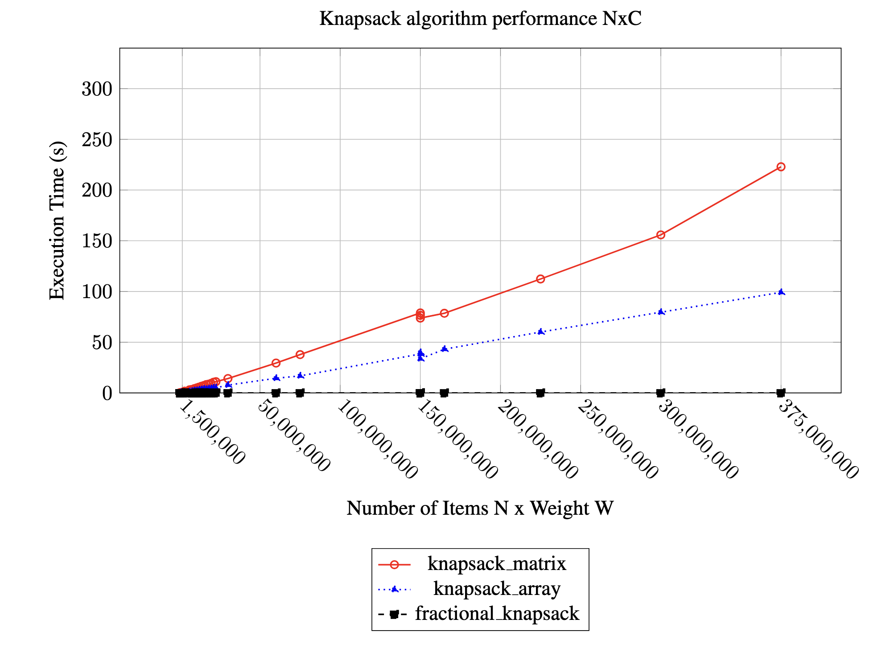

# Exercise 2 - Knapsack problem

## Exercise description

What must be done:

1. Run the implementation I provided on the set of instances posted on the website;

2. Write two pages analyzing the results.
   Page formatting: read the “Page layout” section of the text in the file
   "IJSRCSEIT\_Paper\_Template\_A4".

   The analysis must include:

   a. A description of the problem investigated;

   b. Comparisons of the execution times of the two implementations considered;

   c. Your opinions on the results obtained.

3. Submit the analysis via Moodle by 11:50 p.m. on 08/01/2025.

## Notes

The biggest problem here is that there are some instances that are really big. 
Since my machine with highest amount of RAM has 16 GB of RAM, it was necessary 
to create a temporary virtual instance to run it. 
The consequence is that the result of the biggest instance will differs 
in comparison to the others.

## How to run

1. Change in `DP-knapsack_problem.py`, the instancePath, to point to 
the `ToProcess` directory that has the instances that you want to run.
2. Run `python3 DP-knapsack_problem.py`.

## Results

### Report

Complete report with: execution time, aggregated data graphs, 
execution environment, problem definition.

- [Knapsack execution report v1](./report/TC2025_Knapsack_Problem.pdf)

### Some execution results

